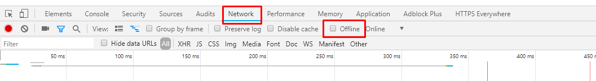
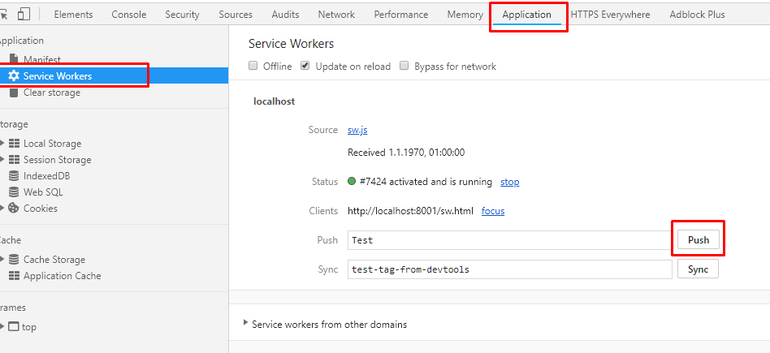

# Service Worker Example

## Demo

1. Setup a local server via: `python3 -m http.server 8000`

2. Browse to http://localhost:8000/

    You should see a picture of a dog. 

3. Go offline via dev tools or stop the python server

    

4. click on `a.html` link
    
    You should see one (the left) of the two pictures, cause just one was already download and cached via ServiceWorker.

5. go back to http://localhost:8000/

    Now you should see a Cat instead a Dog. That's why the Dog is not cached and the Cat is used as a fallback. 

6. Push - click on `clickme` button

    This triggers a Notification.
    
    Send a push notification via dev tools;
    
